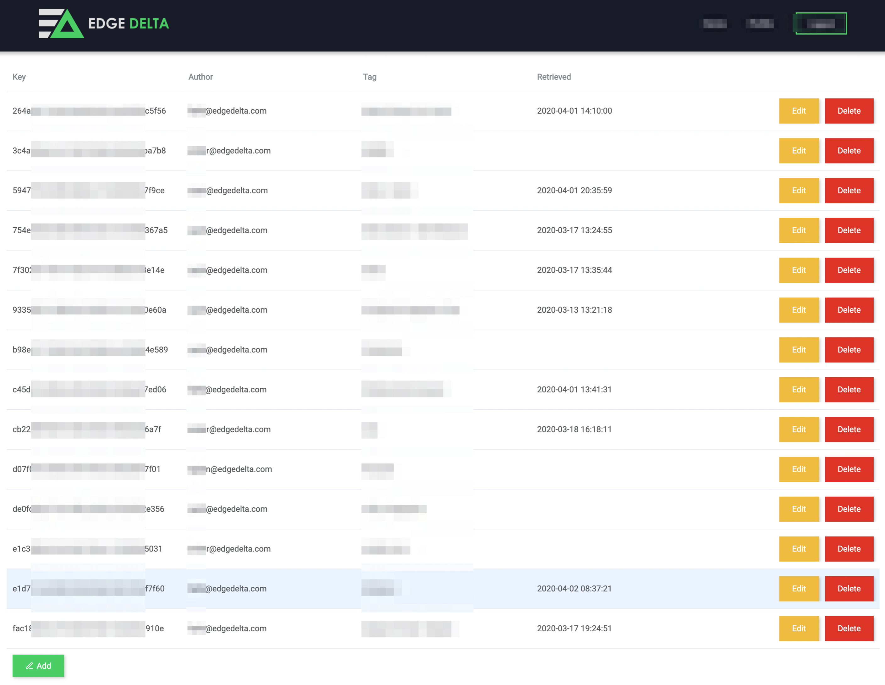

# Central Configuration Backend \(CCB\)

The Edge Delta Central Configuration Backend \(CCB\) is a service provided by Edge Delta to help with the process of generating and deploying configuration files utilized by the Edge Delta service. 

With CCB, users can use the Edge Delta UI to create and manage configuration files, as well as automatically generate configuration API Keys used to pre-configure agents upon deployment.   

Additionally, CCB allows users to update and modify configuration files directly through the UI, automatically propagating changes down to running agents.  




## Local Configuration File Management

In addition to the Central Configuration Backend \(CCB\), Edge Delta also supports the ability to manage and deploy configuration files locally if preferred, using tools like Chef, Puppet, Ansible, Salt, Terraform, etc. 

In order to provide the configuration locally, a flag must be provided at agent deploy time to let the system know Local Configuration File Management is in place.

 **Run Parameter:**

-c path/to/config.yml

**Linux Example:** .

```text
./edge_delta.sh -c /opt/configs/edge_delta.yml
```

**Windows Example:**

```
start /wait msiexec /qn /i edgedelta-version_64bit.msi -c /opt/configs/edge_delta.yml
```


\*\*\*\*


###  


### 

### 


### Configuration File - Example


