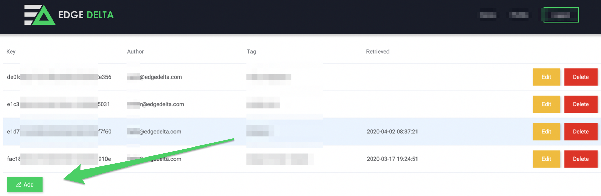

# Central Configuration Backend \(CCB\)

The Edge Delta Central Configuration Backend \(CCB\) is a service provided by Edge Delta to help with the process of generating and deploying configuration files utilized by the Edge Delta service. 

With CCB, users can use the Edge Delta UI to create and manage configuration files, as well as automatically generate configuration API Keys used to pre-configure agents upon deployment.   

Additionally, CCB allows users to update and modify configuration files directly through the UI, automatically propagating changes down to running agents.  


## Creating a New Configuration

In the Edge Delta admin portal, click the green Add button in the bottom left corner to generate a new configuration.



In the following dialog window, populate the Tag and Description fields \(used for organizing the configurations in the Admin portal\), as well as your configuration, and hit save.


Once you've saved your configuration, you will return to the configuration portal, where your new configuration will be listed, as well as an API Key associated with the configuration. 

The API Key is utilized as part of the agent deployment process, allowing new agents to install and deploy pre-configured based on a configuration from the portal. 

## Updating an Existing Configuration

To edit an existing configuration, hit the yellow Edit button to the right of the configuration you wish to edit.  Once you've made your changes, hit the green Save button in the bottom right to save your changes.

To apply the updated configuration to agents that are already deployed and running, simply restart the agent's service, and the updated configuration will automatically propagate down to the agent. 

## Local Configuration File Management

In addition to the Central Configuration Backend \(CCB\), Edge Delta also supports the ability to manage and deploy configuration files locally if preferred, using tools like Chef, Puppet, Ansible, Salt, Terraform, etc. 

In order to provide the configuration locally, a flag must be provided at agent deploy time to let the system know Local Configuration File Management is in place.

 **Run Parameter:**

-c path/to/config.yml

**Linux Example:** .

```text
./edge_delta.sh -c /opt/configs/edge_delta.yml
```

**Windows Example:**

```
start /wait msiexec /qn /i edgedelta-version_64bit.msi -c /opt/configs/edge_delta.yml
```


\*\*\*\*


###  


### 

### 


### Configuration File - Example


