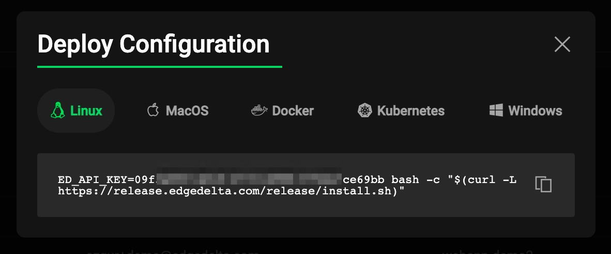
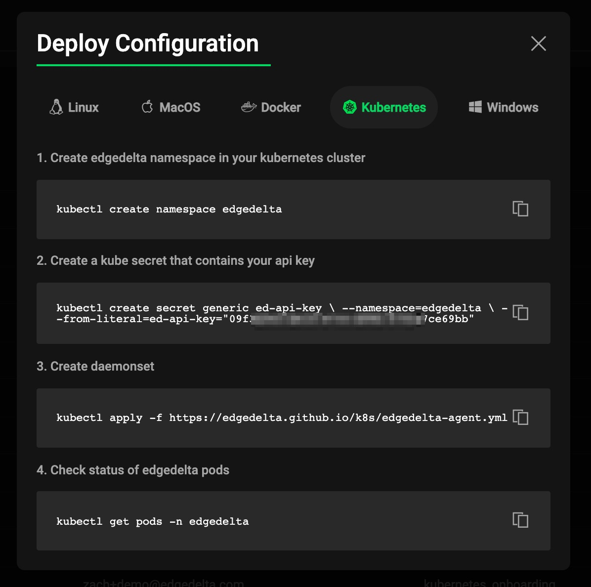

# Installation

The Edge Delta installation package is available and fully supported for install on hosts running Windows, Linux, and MacOS operating systems. A Docker image is also available for containerized environments.

Select from the following deployment types below to review the appropriate documentation:

* [Windows](windows.md)
* [Linux](linux.md)
* [MacOS](macos.md)
* [Docker](docker.md)
* [Kubernetes](kubernetes.md)
* [Kubernetes via Helm](helm.md)
* [AWS ECS](https://docs.edgedelta.com/installation/amazon-ecs)

In addition - within the admin console, many of the commands needed for installation can be created for you automatically through the wizard.

Linux Example:

Kubernetes Example:

