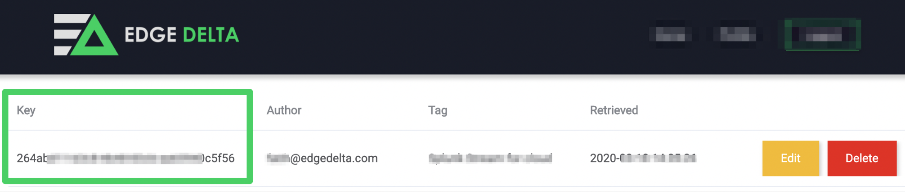

# MacOS

Edge Delta provides a convenient self extracting installer package for MacOS.

## Download

Contact the Edge Delta team [info@edgedelta.com](mailto:info@edgedelta.com) to create an account and get access to the agent deployment portal. 

## Installation

Replace the &lt;YOUR\_API\_KEY&gt; field from the command below with your configuration API Key from the administration portal: 



Replace the &lt;DOWNLOAD\_URL&gt; field from the command below with the installation endpoint URL you received from the Edge Delta team.

```text
ED_API_KEY=<YOUR_API_KEY> bash -c "$(curl -L <DOWNLOAD_URL>/install.sh)"
```

The installation process may prompt for the sudo password if you are not running as root. 

The installation process deploys Edge Delta into the path`/opt/edgedelta/agent/` and system service `edgedelta` starts automatically with default configuration.

## Troubleshooting

Check the service status using the following command

```text
launchctl list edgedelta
```

Configuration File path: `/opt/edgedelta/agent/config.yaml`

Edge Delta's Service Log file path: `/opt/edgedelta/agent/edgedelta.log`

